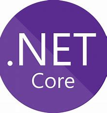

# Csharp10 dotNET6 Web Development
A collection of webAPIs, Entity Framework Core and MVC website with a mock DB. Used a large plethora of techniques and tools such as: REST, ASP.NET Core, SQLServer (Microsoft SQL server), Razor and Blazor Web Assembly and Blazor Server, Blazor WebAssembly AOT, Progressive Web App (PWA) support and Javascript. Testing over Fiddler.

